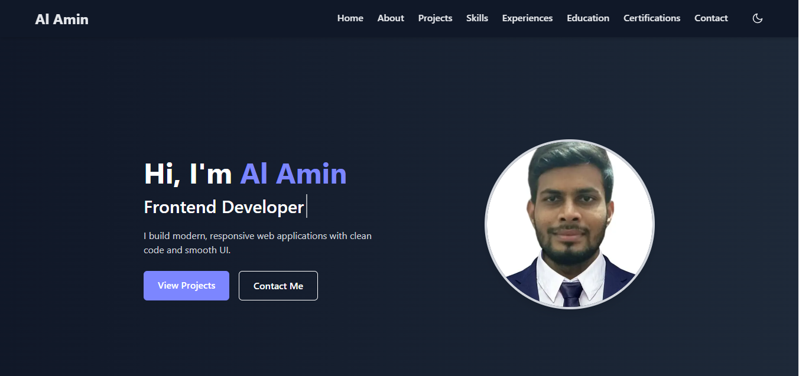

# Al Amin – Personal Portfolio

This is my **personal portfolio website** built using **Next.js**, **Tailwind CSS**, and **Framer Motion**.  
It showcases my skills, projects, experience, and achievements as a **Frontend Developer**.

---

## Live Demo

[Visit My Portfolio](https://portfolio-of-alamincse2003.vercel.app)

---

## Features

✅ Responsive design (mobile-first)  
✅ Smooth animations with **Framer Motion**  
✅ Dark/Light mode toggle  
✅ Contact form with **EmailJS** integration  
✅ Back-to-top button  
✅ Professional layout & section transitions  
✅ Fully optimized for performance (Next.js + Tailwind)

---

## 🛠️ Technologies Used

- Tailwind CSS
- ReactJS
- NextJS
- Framer Motion

---

